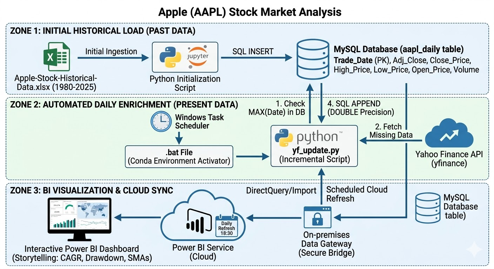

# 🍏 Apple Stock Market Analysis (1980-Present Day)

[](https://powerbi.microsoft.com/)
[](https://www.mysql.com/)
[](https://www.python.org/)
[](https://jupyter.org/)
[](https://pandas.pydata.org/)
[](https://www.sqlalchemy.org/)
[](https://opensource.org/licenses/MIT)

> An end-to-end data engineering and analytics project analyzing historical Apple Inc. (AAPL) stock market data up to the present day, to extract actionable business insights and investment strategies.

---

## 📑 Table of Contents

- [🍏 Apple Stock Market Analysis (1980-Present Day)](#-apple-stock-market-analysis-1980-present-day)
  - [📑 Table of Contents](#-table-of-contents)
  - [🚀 Project Overview](#-project-overview)
  - [🏗️ Project Architecture](#️-project-architecture)
    - [Zone 1: Initial Historical Load (Past Data)](#zone-1-initial-historical-load-past-data)
    - [Zone 2: Automated Daily Enrichment (Present Data)](#zone-2-automated-daily-enrichment-present-data)
      - [A. Local Engine (MySQL)](#a-local-engine-mysql)
      - [B. Cloud Engine (GitHub Actions)](#b-cloud-engine-github-actions)
    - [Zone 3: BI Visualization \& Cloud Sync](#zone-3-bi-visualization--cloud-sync)
    - [Core Technologies Workflow](#core-technologies-workflow)
  - [🎨 Power BI Dashboard Design \& Architecture](#-power-bi-dashboard-design--architecture)
    - [1. Data Architecture (The Backend)](#1-data-architecture-the-backend)
    - [2. User Interface (The Frontend)](#2-user-interface-the-frontend)
    - [3. Advanced Storytelling \& Context](#3-advanced-storytelling--context)
    - [4. High-Density Visuals (IBCS \& SVG)](#4-high-density-visuals-ibcs--svg)
  - [📊 Data Profile Summary](#-data-profile-summary)
  - [💡 Business Recommendations](#-business-recommendations)
    - [1. The "Cook" Premium](#1-the-cook-premium)
    - [2. The "Buy the Dip" Signal](#2-the-buy-the-dip-signal)
    - [3. 2026 Outlook \& AI Hype](#3-2026-outlook--ai-hype)
  - [📂 Repository Structure](#-repository-structure)
  - [⚙️ Getting Started](#️-getting-started)
    - [Prerequisites](#prerequisites)
    - [Installation](#installation)

---

## 🚀 Project Overview

This project focuses on the ingestion, processing, and visualization of Apple’s stock market data spanning from **1980 to the present day**, using the Yahoo Finance API for continuous daily updates. By combining **Python** for initial profiling, **MySQL** for robust relational data storage and querying, and **Power BI** for interactive dashboards, this project highlights how historical and current market trends can inform future investment strategies.

📊 **[View the Executive Business Case Presentation (Google Slides)](https://docs.google.com/presentation/d/1v5ssMhSDsMxkJXG-Xy1a-X05HoXnfY5Ce7pQUGvhGaE/edit?usp=sharing)**
For an actionable breakdown of the engineering pipeline and the resulting strategic insights, you can also refer to the [Presentation Outline](docs/business_case_presentation.md).

---

## 🏗️ Project Architecture



This diagram visualizes the end-to-end architecture of your Apple Stock (AAPL) data analysis project. It is structured horizontally and vertically to show how different technologies interact to move data from historical sources and the live API through your database and into the visualization layer.

The pipeline is organized into three distinct labeled zones that correspond to the lifecycle of the project:

### Zone 1: Initial Historical Load (Past Data)

This section represents the one-time, manual setup phase where you imported the long-term historical data.

- **Excel Source:** The `Apple-Stock-Historical-Data.xlsx` file (1980–2025) is the origin.
- **Python Script (Initialization):** A Python script (often run in a Jupyter Notebook for one-time loads) reads the Excel file, cleans the data, and formats it for ingestion.
- **MySQL Database:** The script uses an SQL `INSERT` command to populate the main `aapl_daily` table. As you requested, this table uses high-precision `DOUBLE` and `BIGINT` types to prevent data truncation.

### Zone 2: Automated Daily Enrichment (Present Data)

This pipeline features two parallel refresh engines: a local MySQL daemon and a serverless GitHub Actions workflow.

#### A. Local Engine (MySQL)

- **Python Automation Daemon:** The `yf_update.py` script utilizes the `schedule` library to run automatically every day at 18:00 (after market close).
- **Logic:** Queries MySQL for MAX date, calls `yfinance` API, flattens data, appends to the database, and exports a local `aapl_daily.csv`.

#### B. Cloud Engine (GitHub Actions)

- **Serverless Automation:** A cron-triggered workflow (`.github/workflows/data_update.yml`) runs daily at 22:00 UTC.
- **Python CSV Updater:** The `gh_update_csv.py` script bypasses MySQL entirely by reading the repo's existing `aapl_daily.csv`, fetching missing Yahoo Finance records, and appending them directly.
- **Git Push:** A bot automatically commits the updated CSV back to the repository, ensuring a completely serverless, cloud-native data feed.

### Zone 3: BI Visualization & Cloud Sync

This final section shows how the data moves from your local computer into Microsoft's cloud for the end user to view.

- **MySQL Database:** The shared data repository is the single source of truth.
- **On-premises Data Gateway:** This is the critical security bridge we discussed. Installed on your PC, it creates a secure tunnel between your local MySQL database and Power BI Service.
- **Power BI Service (Cloud):** Microsoft's cloud-based platform holds the dataset and executes a Scheduled Refresh (18:30) that reaches through the gateway to pull new data from MySQL.
- **Interactive Dashboard:** The end-user view where your CAGR, Drawdown, and Moving Average analysis are visualized on the web or mobile.

### Core Technologies Workflow

1. **Data Acquisition & Automation (yfinance/SQLAlchemy):** Automated daily extraction via `yfinance` API and seamless loading into MySQL using `SQLAlchemy`.
2. **Data Profiling & Validation (Python/Pandas):** Live database connection to perform initial dataset exploration, quality checking, and API cross-validation.
3. **Data Storage & Transformation (MySQL):** Persistent robust storage, data cleansing imputation, aggregations, window functions (moving averages), and structured queries to prep the data for visualization.
4. **Interactive Visualization (Power BI):** Business intelligence dashboards that bring the "Cook Premium" and the "Buy the Dip" signals to life.

---

## 🎨 Power BI Dashboard Design & Architecture

Your dashboard is now a fully realized, enterprise-grade financial application. Here is the final summary of the architecture deployed:

### 1. Data Architecture (The Backend)

- **Pattern:** Star Schema. Fact tables (`aapl_daily`, `sp500_daily`) connected to a central Date dimension (`Calendar`).
- **Optimization:** $O(N^2)$ bottlenecks (Drawdown, Volatility, Beta) were stripped out of DAX measures and materialized into Calculated Columns during the refresh phase.
- **Result:** The dashboard renders instantly, even when calculating complex linear regressions over 11,000 days.

### 2. User Interface (The Frontend)

- **Framework:** "Glassmorphism" Apple Dark Mode (`#1d1d1f`, `#f5f5f7`, System Colors).
- **Theme Enforcement:** Controlled entirely by a global JSON Theme file to ensure 1920x1080 resolution and automated visual styling (rounded corners, shadows).
- **Headers & Cards:** Built using HTML Content visuals for flexbox alignment, gradient backgrounds, and scalable SVG icons, bypassing Power BI's rigid native shapes.

### 3. Advanced Storytelling & Context

- **PiotrBartela.TitleContext:** Used to translate slicer inputs into human-readable presentation strings (e.g., "Last 5 Years" instead of "2020-2025").
- **SavoryData:** Integrated into native Power BI Buttons as hovering "Badges" to explicitly state active filter contexts above charts.
- **Automated Advisory:** A DAX `SWITCH` statement acts as a quantitative analyst, writing dynamic text paragraphs based on RSI, Moving Averages, and Beta.

### 4. High-Density Visuals (IBCS & SVG)

- **PowerofBI.IBCS:** Embedded in matrices to show standardized Absolute Variance (YoY price changes) using red/green delta bars.
- **DaxLib.SVG:** Used to render granular Price Trend sparklines and Volatility Boxplots inside table rows.
- **XU.SVG.Progress:** Deployed inside Report Page Tooltips to provide instant visual context (Donuts, Capsules) on hover, without cluttering the main canvas.

For the definitive deployment checklist and the custom HTML landing page DAX measure, refer to the [Power BI Dashboard Design & Storytelling Guide](docs/powerbi_dashboard_design.md).

---

## 📊 Data Profile Summary

| Metric | Profile Result | Status |
| :--- | :--- | :--- |
| **Row Count** | `11,412` | Continuously updated via yfinance API |
| **Date Range** | `1980-12-12` to `present day` | Covers all major modern market cycles |
| **Missing Values** | 0 Nulls | High Quality |
| **Price Consistency** | High >= Low/Open/Close | 100% Logic Pass |
| **Volume Anomaly** | 1 row with 0 Volume (1981-08-10) | Needs imputation |
| **Adj Close Range** | $0.037 to $259.02 | Verified (Split-adjusted) |
| **API Validation** | Passed | 100% Match with External Source |

**Quality Score:** 98% (Excellent completeness; only one minor volume anomaly detected).

---

## 💡 Business Recommendations

*Based on preliminary data profiling and historical analysis:*

### 1. The "Cook" Premium

Post-2011 (under Tim Cook's leadership), Apple's volatility steadily decreased while institutional ownership and share buybacks increased.

- **Recommendation for Portfolio Managers:** AAPL should be treated as a **"Core Equity"** (value/stability) rather than purely a **"Growth Speculation."**

### 2. The "Buy the Dip" Signal

Historical backtesting data shows a prominent and recurring pattern.

- **Recommendation:** A price drawdown of **>20%** while the **200-day Simple Moving Average (SMA)** remains upward-sloping has been a high-probability entry point for over 30 years.

### 3. 2026 Outlook & AI Hype

Looking ahead, based on the 2024-2025 "AI Hype" trend in the data:

- **Recommendation:** Monitor volume-to-price divergence closely. If trading volume *declines* while the stock price continues to hit new all-time highs, it serves as a strong technical suggestion for **partial profit-taking**.

---

## 📂 Repository Structure

```plaintext
├── .github/                 # CI/CD Automations
│   └── workflows/
│       └── data_update.yml  # Automated Cron job for serverless data load
├── data/                    # Datasets
│   ├── raw/               # Original, immutable datasets (CSV, Excel)
│   └── processed/         # Cleaned and transformed data for DB ingestion
├── dashboard/             # Power BI dashboard files
│   ├── Apple-AAPL-Stock-Market-Analysis-Dashboard.pbip
│   ├── Apple-AAPL-Stock-Market-Analysis-Dashboard.pbix
│   ├── Apple-AAPL-Stock-Market-Analysis-Dashboard.Report/
│   ├── Apple-AAPL-Stock-Market-Analysis-Dashboard.SemanticModel/
│   └── theme/             # Custom JSON themes and assets
├── images/                # Exported diagrams and graphics
│   └── pipeline_architecture.jpg
├── docs/                  # Technical documentation
│   ├── data_pipeline.md             # Data flow and architecture
│   ├── data_lineage.md              # Origin-to-destination map
│   ├── data_lineage_architecture.drawio # Visual Draw.io representation
│   ├── business_case_presentation.md # Business Case slide outline
│   └── powerbi_dashboard_design.md  # Power BI UI/UX & DAX architecture
├── presentation/          # Executive summary and business case decks
│   ├── Apple-AAPL-Stock-Market-Analysis-Business-Case-and-Strategies-1980-2025.pdf
│   └── Apple-AAPL-Stock-Market-Analysis-Business-Case-and-Strategies-1980-2025.pptx
├── notebooks/             # Jupyter notebooks
│   ├── 01_data_profiling.ipynb  # Initial EDA and assertions
│   ├── 02_data_loading.ipynb    # Incremental data pipeline via yfinance
│   └── 03_data_validation.ipynb # Automated data quality & API cross-validation
├── scripts/               # Automation scripts
│   ├── test_duplicate.py        # Utility script testing yfinance duplicate handling
│   ├── yf_update.py             # Python daemon script for local MySQL incremental updates
│   └── gh_update_csv.py         # Serverless script for GitHub Actions direct CSV updates
├── sql/                   # MySQL scripts for ELT
│   ├── 01_data_ingestion.sql    # Schema initialization and CSV bulk loading
│   ├── 02_data_cleaning.sql     # Validation, imputation, and anomaly checks
│   └── 03_eda_and_metrics.sql   # CAGR & Simple Moving Average tracking
├── requirements.txt       # Python dependencies
└── .gitignore             # Git ignore definitions
```

---

## ⚙️ Getting Started

### Prerequisites

- **Python 3.10+**
- **MySQL Server 8.0+**
- **Power BI Desktop**

### Installation

1. Clone the repository:

   ```bash
   git clone https://github.com/Sohila-Khaled-Abbas/apple-stock-analytics.git
   ```

2. Navigate to the project directory and install the dependencies:

   ```bash
   pip install -r requirements.txt
   ```

3. Set up the Database:
   - Execute `sql/01_data_ingestion.sql` in your MySQL environment to load the historical CSV.

4. Fetch the latest live data increments:
   - Run `notebooks/02_data_loading.ipynb` to automatically append new dates via the Yahoo Finance API.
   - *Alternatively*, rely on the automated GitHub Actions workflow which intelligently updates the CSV behind the scenes, or run `scripts/yf_update.py` daemon to keep your local database synced.

5. Validate and calculate indicators:
   - Run `sql/02_data_cleaning.sql` to impute missing volumes and check logic.
   - Run `notebooks/03_data_validation.ipynb` to cross-validate database figures against the live Yahoo Finance API.
   - Run `sql/03_eda_and_metrics.sql` to generate Moving Averages and CAGR metrics.

6. Launch Dashboard:
   - Open the interactive dashboard found in `/dashboard/` with Power BI.
