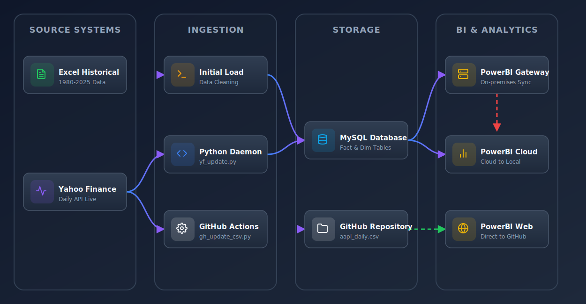
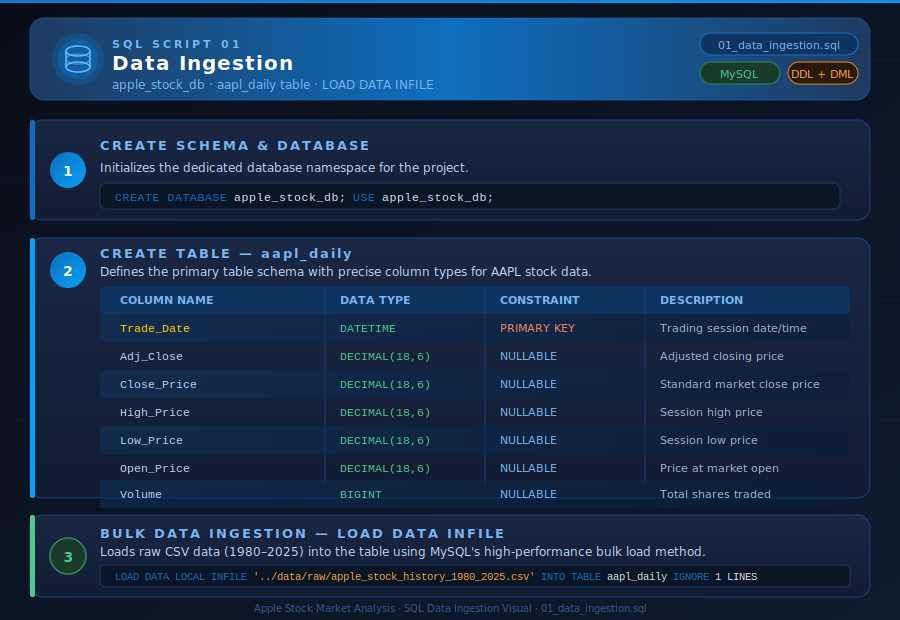
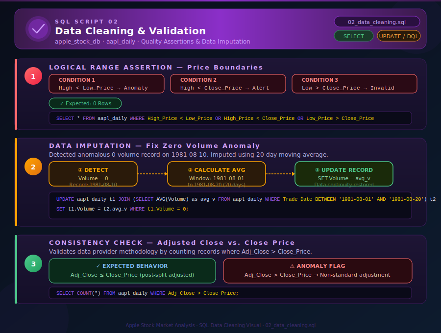
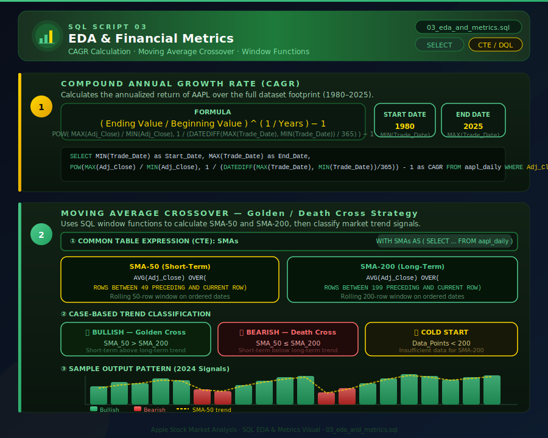
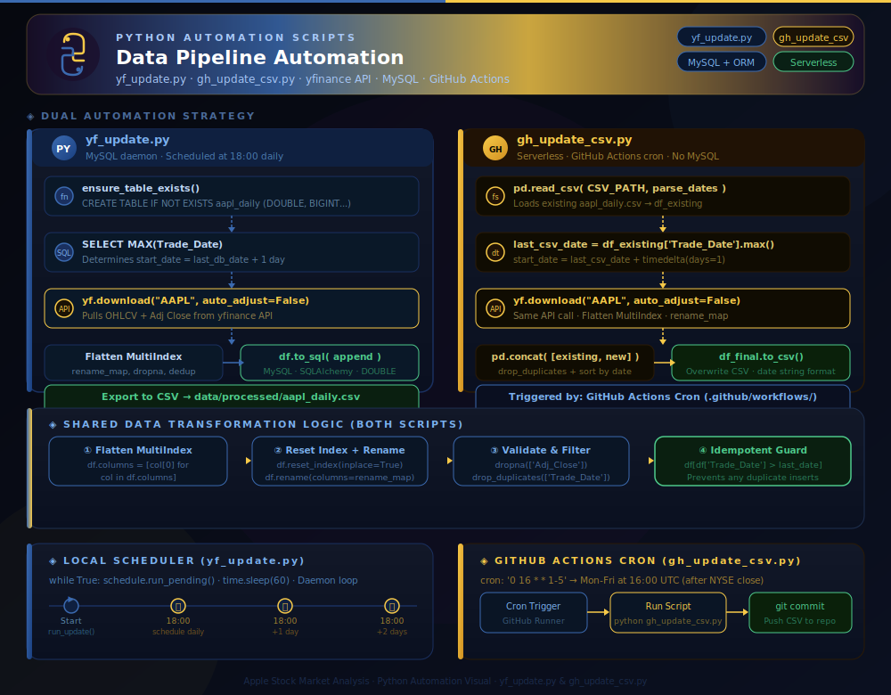

# 🍏 Apple Stock Market Analysis — AAPL (1980 → Present)

<!-- Tech Stack Badges -->
[](https://powerbi.microsoft.com/)
[](https://www.mysql.com/)
[](https://www.python.org/)
[](https://jupyter.org/)
[](https://github.com/features/actions)
[](https://opensource.org/licenses/MIT)

<!-- Library Badges -->
[](https://pandas.pydata.org/)
[](https://www.sqlalchemy.org/)
[](https://pypi.org/project/yfinance/)
[](https://pypi.org/project/PyMySQL/)
[](https://pypi.org/project/openpyxl/)
[](https://pypi.org/project/schedule/)

<!-- Status Badges -->
[](docs/data_pipeline.md)
[](docs/powerbi_dashboard_design.md)
[](docs/powerbi_dashboard_design.md#dax-measure-catalogue)
[](data/)
[](.github/workflows/data_update.yml)
[](https://app.powerbi.com/view?r=eyJrIjoiNTNhYmI1ZjUtNDNhZC00OWM3LWFjYzktMmU0NWYyODYzZjIxIiwidCI6IjI1Y2UwMjYxLWJiZDYtNDljZC1hMWUyLTU0MjYwODg2ZDE1OSJ9)

> An end-to-end **data engineering and analytics** project analyzing historical Apple Inc. (AAPL) stock market data from 1980 to the present day — combining an automated MySQL pipeline, GitHub Actions cloud sync, and an enterprise-grade Power BI dashboard to extract actionable investment insights.

---

## 📑 Table of Contents

- [🚀 Project Overview](#-project-overview)
- [🏗️ Project Architecture](#️-project-architecture)
  - [Data Lineage Architecture](#data-lineage-architecture)
  - [Zone 1: Initial Historical Load](#zone-1-initial-historical-load-past-data)
  - [Zone 2: Automated Daily Enrichment](#zone-2-automated-daily-enrichment-present-data)
  - [Zone 3: BI Visualization & Cloud Sync](#zone-3-bi-visualization--cloud-sync)
- [🗂️ Code Documentation Visuals](#️-code-documentation-visuals)
- [🎨 Power BI Dashboard Design & Architecture](#-power-bi-dashboard-design--architecture)
  - [Semantic Model (Backend)](#1-semantic-model-the-backend)
  - [7-Page Report Structure](#2-7-page-report-structure)
  - [Advanced Storytelling & Context](#3-advanced-storytelling--context)
  - [High-Density Visuals (IBCS, SVG & Deneb)](#4-high-density-visuals-ibcs-svg--deneb)
- [📊 Data Profile Summary](#-data-profile-summary)
- [💡 Business Recommendations](#-business-recommendations)
- [📂 Repository Structure](#-repository-structure)
- [⚙️ Getting Started](#️-getting-started)

---

## 🚀 Project Overview

This project focuses on the ingestion, processing, and visualization of Apple's stock market data spanning from **1980 to the present day**, using the Yahoo Finance API for continuous daily updates. By combining **Python** for initial profiling and automation, **MySQL** for robust relational data storage and querying, and **Power BI** for interactive institutional-grade dashboards, this project demonstrates how historical and current market trends can inform actionable investment strategies.

📊 **[View the Executive Business Case Presentation (Google Slides)](https://docs.google.com/presentation/d/1v5ssMhSDsMxkJXG-Xy1a-X05HoXnfY5Ce7pQUGvhGaE/edit?usp=sharing)**

📺 **[▶ View the Live Interactive Dashboard (Power BI Web)](https://app.powerbi.com/view?r=eyJrIjoiNTNhYmI1ZjUtNDNhZC00OWM3LWFjYzktMmU0NWYyODYzZjIxIiwidCI6IjI1Y2UwMjYxLWJiZDYtNDljZC1hMWUyLTU0MjYwODg2ZDE1OSJ9)**

For an actionable breakdown of the engineering pipeline and the resulting strategic insights, refer to the [Presentation Outline](docs/business_case_presentation.md).

---

## 🏗️ Project Architecture


### Data Lineage Architecture



This diagram visualizes the end-to-end architecture of the Apple Stock (AAPL) data analysis project. It is structured horizontally to show how different technologies interact to move data from historical sources and the live API through the database and into the visualization layer.

The pipeline is organized into three distinct labeled zones that correspond to the lifecycle of the project:

### Zone 1: Initial Historical Load (Past Data)

[]()
[]()
[]()

This section represents the one-time, manual setup phase where the long-term historical data was imported.

- **Excel Source:** `Apple-Stock-Historical-Data.xlsx` (1980–2025) is the origin point.
- **Python Script (Initialization):** A Python script (run in Jupyter Notebook for one-time load) reads the Excel file, cleans the data, and formats it for ingestion.
- **MySQL Database:** The script uses `SQLAlchemy` to bulk-insert records into the main `aapl_daily` table with high-precision `DOUBLE` and `BIGINT` types to prevent data truncation.

### Zone 2: Automated Daily Enrichment (Present Data)

This pipeline features **two parallel refresh engines**: a local MySQL daemon and a serverless GitHub Actions workflow.

#### A. Local Engine (MySQL)

[]()
[]()

- **Python Automation Daemon:** `scripts/yf_update.py` uses the `schedule` library to run automatically every day at 18:00 (after market close).
- **Logic:** Queries MySQL for `MAX(Trade_Date)`, calls the `yfinance` API for new records, flattens the data, appends to the database, and exports a synced `aapl_daily.csv`.

#### B. Cloud Engine (GitHub Actions)

[]()
[]()

- **Serverless Automation:** A cron-triggered workflow (`.github/workflows/data_update.yml`) runs on weekdays at 16:00 UTC.
- **Python CSV Updater:** `scripts/gh_update_csv.py` bypasses MySQL entirely — reads the existing repo `aapl_daily.csv`, fetches only missing Yahoo Finance records, and appends them.
- **Git Push:** A bot automatically commits the updated CSV back to the repository, ensuring a completely serverless, zero-infrastructure data feed.

### Zone 3: BI Visualization & Cloud Sync

[]()
[]()

- **MySQL Database:** The single source of truth for local, on-premises analytics.
- **On-premises Data Gateway:** Installed on the local PC, creates a secure tunnel between the local MySQL database and Power BI Service.
- **Power BI Service (Cloud):** Holds the dataset and executes a Scheduled Refresh (18:30) that reaches through the gateway to pull new data from MySQL.
- **Interactive Dashboard:** The end-user view with CAGR, Drawdown, Moving Averages, and Beta analysis accessible on web and mobile.

### Core Technologies Workflow

| # | Stage | Technology | Purpose |
|:-:|:------|:-----------|:--------|
| 1 | **Data Acquisition** | `yfinance` + `SQLAlchemy` | Automated daily API extraction and loading into MySQL |
| 2 | **Data Profiling** | Python + `Pandas` | EDA, quality checking, and API cross-validation |
| 3 | **Data Storage** | MySQL | Persistent storage, imputation, window functions (moving averages) |
| 4 | **Visualization** | Power BI | Institutional-grade dashboards with DAX + HTML + SVG + Deneb |

---

## 🗂️ Code Documentation Visuals

[](images/code_docs_hub.html)

The following SVG diagrams visually document every SQL and Python script in the project — mapping the logic, data flow, and key operations at a glance. Each diagram uses a modern dark-mode design with colour-coded steps and embedded code snippets.

> 💡 **Tip:** Click any image to open the full-resolution SVG in your browser. An interactive gallery is available at [`images/code_docs_hub.html`](images/code_docs_hub.html).

---

### SQL Scripts

#### 01 · Data Ingestion

[](sql/01_data_ingestion.sql)

> **`sql/01_data_ingestion.sql`** — Initialises the `apple_stock_db` schema, creates the `aapl_daily` table with exact column types, and bulk-loads 45 years of historical AAPL data via `LOAD DATA INFILE`.



---

#### 02 · Data Cleaning & Validation

[](sql/02_data_cleaning.sql)

> **`sql/02_data_cleaning.sql`** — Runs three quality checks: a logical price-boundary assertion, a zero-volume anomaly imputation using a 20-day moving average window, and an Adjusted-Close consistency audit.



---

#### 03 · EDA & Financial Metrics

[](sql/03_eda_and_metrics.sql)

> **`sql/03_eda_and_metrics.sql`** — Calculates CAGR and implements a Moving Average Crossover strategy (SMA-50 vs SMA-200) using SQL window functions to generate Bullish / Bearish / Cold-Start trend signals.



---

### Python Scripts

#### Python Pipeline Automation

[](scripts/yf_update.py)
[](scripts/gh_update_csv.py)

> Two complementary automation strategies run in parallel:
> - **`yf_update.py`** — A local MySQL daemon scheduled daily at 18:00 via the `schedule` library. Fetches new records from yfinance, transforms them via SQLAlchemy, appends to MySQL, and exports a synced CSV.
> - **`gh_update_csv.py`** — A fully serverless script triggered by GitHub Actions cron (`Mon–Fri 16:00 UTC`). Reads the existing repo CSV, fetches only missing dates, concatenates, and pushes the updated file back to the repository — zero infrastructure required.



---

## 🎨 Power BI Dashboard Design & Architecture

[](dashboard/)
[](dashboard/Apple-AAPL-Stock-Market-Analysis-Dashboard.SemanticModel/)
[](dashboard/Apple-AAPL-Stock-Market-Analysis-Dashboard.Report/)
[](docs/powerbi_dashboard_design.md#dax-measure-catalogue)
[](https://app.powerbi.com/view?r=eyJrIjoiNTNhYmI1ZjUtNDNhZC00OWM3LWFjYzktMmU0NWYyODYzZjIxIiwidCI6IjI1Y2UwMjYxLWJiZDYtNDljZC1hMWUyLTU0MjYwODg2ZDE1OSJ9)

> 📺 **[▶ Open Live Interactive Dashboard](https://app.powerbi.com/view?r=eyJrIjoiNTNhYmI1ZjUtNDNhZC00OWM3LWFjYzktMmU0NWYyODYzZjIxIiwidCI6IjI1Y2UwMjYxLWJiZDYtNDljZC1hMWUyLTU0MjYwODg2ZDE1OSJ9)** — No Power BI account required.

Your dashboard is a fully realized, enterprise-grade financial application built on a `.pbip` project structure for complete Git-based source control. Here is the final architecture summary:

### 1. Semantic Model (The Backend)

[]()
[]()

| Table | Type | Source | Key Role |
|:------|:-----|:-------|:---------|
| `aapl_daily` | Fact | MySQL `apple_stock_db` | Primary AAPL price & volume data + M-layer enrichments |
| `sp500_daily` | Fact | yfinance Python API in Power Query | S&P 500 benchmark data for Beta/Alpha calculations |
| `Calendar` | Dimension | Power Query (auto-generated) | CEO Era labels, Decade groupings, trading day flags |
| `Technical_Metrics` | Derived Fact | aapl_daily → Python script | 50-Day SMA, 200-Day SMA, RSI via Wilder's Smoothing |
| `_Measures` | Measure Table | Empty placeholder | Houses all 47 DAX measures across 11 display folders |
| `Data Dictionary` | Reference | DAX `DATATABLE` | Auto-generated catalog of all columns and measures |

**Optimization:** O(N²) bottlenecks (`Drawdown`, `Volatility`, `Beta`) were materialized into Calculated Columns — reducing `Days Since ATH` latency from **~2,900ms → ~5ms** (580× speedup).

### 2. 7-Page Report Structure

[]()
[]()

| # | Page Name | Page ID Prefix | Purpose |
|:-:|:----------|:-------------|:--------|
| 1 | **Home** | `e2777422...` | Full-screen Apple-style landing page with CSS3 animations & live KPIs |
| 2 | **Executive Macro View** | `3244a5c5...` | Price action, Decade matrix, KPI strip, CEO Era slicer |
| 3 | **Technical & Momentum Deep Dive** | `ca8e0f16...` | SMA crossover, RSI oscillator, Volume surge, Advisory engine |
| 4 | **Tooltip — Macro** | `371ac192...` | Hidden tooltip: drawdown bar, SMA premium |
| 5 | **Tooltip — Technical** | `bed98526...` | Hidden tooltip: RSI heat bar + intraday spread |
| 6 | **Analytics — Deneb Charts** | `a2ee985a...` | Candlestick + Volume-at-Price (Vega-Lite) |
| 7 | **Analytics — IBCS Matrix** | `75bf5858...` | YoY variance bars (IBCS notation) |

### 3. Advanced Storytelling & Context

[]()
[]()

- **PiotrBartela.TitleContext:** Translates raw slicer inputs to "Last 5 Years" / "Jobs Era" narrative strings in page headers.
- **SavoryData.Selection2List:** Drives native Power BI Buttons as hovering "📅 Horizon: ..." badges showing active filter context.
- **Automated Advisory Engine:** `Dynamic Business Recommendation` — a DAX `SWITCH` statement acting as a quant analyst, generating narrative paragraphs from RSI, Trend State, Drawdown, and Beta values.

### 4. High-Density Visuals (IBCS, SVG & Deneb)

[]()
[]()
[]()

- **`PowerofBI.IBCS`:** Embedded in matrices for standardized red/green Absolute Variance bars (YoY price changes).
- **`DaxLib.SVG`:** Renders granular 160×45px Price Trend sparklines and Volatility Boxplots as `ImageUrl` table cells.
- **`XU.SVG.Progress`:** Deployed in Report Page Tooltips to render progress donuts and capsule bars on hover.
- **Deneb (Vega-Lite):** Powers the AAPL Candlestick chart and Volume-at-Price histogram — using `Is Trading Day` and `Trade Date Key` measures to filter non-trading days and prevent rendering artifacts.

For the definitive deployment checklist, table definitions, full DAX catalogue, and all HTML/DAX snippets, refer to the [Power BI Dashboard Design & Architecture Guide](docs/powerbi_dashboard_design.md).

---

## 📊 Data Profile Summary

[]()
[]()
[]()

| Metric | Profile Result | Status |
| :--- | :--- | :---: |
| **Row Count** | `11,400+` | ✅ Growing daily via yfinance API |
| **Date Range** | `1980-12-12` → `present day` | ✅ All major market cycles |
| **Missing Values** | 0 Nulls | ✅ High Quality |
| **Price Consistency** | High ≥ Low/Open/Close | ✅ 100% Logic Pass |
| **Volume Anomaly** | 1 row (1981-08-10, volume = 0) | ⚠️ Imputed via 20-day MA |
| **Adj Close Range** | `$0.037` → `$259.02` | ✅ Verified (Split-adjusted) |
| **API Validation** | Passed | ✅ 100% Match with yfinance |

**Quality Score: 98% (Excellent completeness; only one minor volume anomaly detected).**

---

## 💡 Business Recommendations

*Based on preliminary data profiling and 45 years of historical analysis:*

### 1. The "Cook" Premium

[]()

Post-2011 (under Tim Cook's leadership), Apple's volatility steadily decreased while institutional ownership and share buybacks increased.

- **Recommendation for Portfolio Managers:** AAPL should be treated as a **"Core Equity"** (value/stability) rather than purely a **"Growth Speculation."**

### 2. The "Buy the Dip" Signal

[]()

Historical backtesting data shows a prominent and recurring pattern.

- **Recommendation:** A price drawdown of **>20%** while the **200-Day SMA** remains upward-sloping has been a high-probability entry point for over 30 years.

### 3. 2026 Outlook & AI Hype

[]()

Based on the 2024–2025 "AI Hype" trend in the data:

- **Recommendation:** Monitor volume-to-price divergence closely. If trading volume *declines* while the stock price continues to hit new all-time highs, it suggests strong technical grounds for **partial profit-taking**.

---

## 📂 Repository Structure

```plaintext
Apple Stock Market Analysis/
│
├── .github/                           # CI/CD Automations
│   └── workflows/
│       └── data_update.yml            # Serverless daily CSV update (Mon–Fri 16:00 UTC)
│
├── dashboard/                         # Power BI Project Files
│   ├── Apple-AAPL-Stock-Market-Analysis-Dashboard.pbip   ← Open this to edit
│   ├── Apple-AAPL-Stock-Market-Analysis-Dashboard.pbix   ← Compiled snapshot
│   ├── Apple-AAPL-Stock-Market-Analysis-Dashboard.Report/
│   │   └── definition/
│   │       ├── report.json
│   │       └── pages/                 ← 7 × page.json + visuals (JSON)
│   ├── Apple-AAPL-Stock-Market-Analysis-Dashboard.SemanticModel/
│   │   └── definition/
│   │       ├── model.tmdl             ← Model settings, culture, query order
│   │       ├── relationships.tmdl    ← 3 table relationships
│   │       ├── functions.tmdl        ← 5 injected UDF libraries (~344 KB)
│   │       ├── tables/
│   │       │   ├── aapl_daily.tmdl   ← Fact: AAPL data (MySQL source)
│   │       │   ├── sp500_daily.tmdl  ← Fact: S&P 500 (yfinance Python source)
│   │       │   ├── Calendar.tmdl     ← Dimension: CEO Eras, Decades
│   │       │   ├── _Measures.tmdl    ← All 47 DAX measures
│   │       │   ├── Technical_Metrics.tmdl  ← SMA50, SMA200, RSI (Python-computed)
│   │       │   └── Data Dictionary.tmdl    ← Auto-generated measure catalog
│   │       └── cultures/en-US/
│   │   ├── DAXQueries/                ← Saved DAX Query View scripts
│   │   └── diagramLayout.json
│   └── theme/                         ← Custom JSON theme & assets
│
├── data/                              # Datasets
│   ├── raw/                           # Original, immutable datasets (CSV, Excel)
│   └── processed/                     # Cleaned and transformed data for DB ingestion
│
├── docs/                              # Technical Documentation
│   ├── data_pipeline.md               # Data flow and architecture notes
│   ├── data_lineage.md                # Origin-to-destination lineage map
│   ├── data_lineage_architecture.drawio  # Visual Draw.io representation
│   ├── business_case_presentation.md  # Business case slide outline
│   └── powerbi_dashboard_design.md    # ★ Power BI UI/UX, TMDL & DAX catalogue
│
├── images/                            # Exported Diagrams & Graphics
│   ├── pipeline_architecture.jpg      # High-level pipeline overview
│   ├── data_lineage_architecture.svg  # SVG lineage diagram
│   ├── data_lineage_architecture.png  # PNG fallback
│   ├── sql_01_data_ingestion.svg      # SQL script documentation visual
│   ├── sql_02_data_cleaning.svg       # SQL script documentation visual
│   ├── sql_03_eda_metrics.svg         # SQL script documentation visual
│   ├── python_automation_visual.svg   # Python scripts documentation visual
│   └── code_docs_hub.html             # 🖼️ Interactive gallery of all visuals
│
├── notebooks/                         # Jupyter Notebooks
│   ├── 01_data_profiling.ipynb        # Initial EDA and data assertions
│   ├── 02_data_loading.ipynb          # Incremental pipeline via yfinance
│   └── 03_data_validation.ipynb       # Automated quality & API cross-validation
│
├── presentation/                      # Executive Summary Decks
│   ├── Apple-AAPL-Stock-Market-Analysis-Business-Case-and-Strategies-1980-2025.pdf
│   └── Apple-AAPL-Stock-Market-Analysis-Business-Case-and-Strategies-1980-2025.pptx
│
├── scripts/                           # Automation Scripts
│   ├── test_duplicate.py              # Utility: tests yfinance duplicate handling
│   ├── yf_update.py                   # Local MySQL daemon: daily incremental update
│   └── gh_update_csv.py               # Serverless: GitHub Actions CSV direct update
│
├── sql/                               # MySQL Scripts (ELT)
│   ├── 01_data_ingestion.sql          # Schema init + LOAD DATA INFILE bulk load
│   ├── 02_data_cleaning.sql           # Validation, imputation, anomaly checks
│   └── 03_eda_and_metrics.sql         # CAGR + SMA window function metrics
│
├── requirements.txt                   # Python dependencies
├── LICENSE                            # MIT License
└── .gitignore                         # Git ignore definitions
```

---

## ⚙️ Getting Started

### Prerequisites

[](https://www.python.org/)
[](https://www.mysql.com/)
[](https://powerbi.microsoft.com/)
[](https://tabulareditor.com/)

### Installation

1. **Clone the repository:**

   ```bash
   git clone https://github.com/Sohila-Khaled-Abbas/apple-stock-market-analysis.git
   cd apple-stock-market-analysis
   ```

2. **Install Python dependencies:**

   ```bash
   pip install -r requirements.txt
   ```

3. **Set up the database:**
   - Start MySQL Server and execute `sql/01_data_ingestion.sql` to initialize the schema and bulk-load historical AAPL data.

4. **Fetch the latest live data increments:**
   - Run `notebooks/02_data_loading.ipynb` to append new dates via the Yahoo Finance API.
   - *Alternatively*, run `scripts/yf_update.py` to keep your local database synced, or rely on the GitHub Actions workflow to update the cloud CSV automatically.

5. **Validate and calculate indicators:**
   - Run `sql/02_data_cleaning.sql` to impute missing volumes and run quality checks.
   - Run `notebooks/03_data_validation.ipynb` to cross-validate database figures against the live API.
   - Run `sql/03_eda_and_metrics.sql` to generate Moving Average and CAGR metrics.

6. **Launch the Power BI Dashboard:**
   - Open `dashboard/Apple-AAPL-Stock-Market-Analysis-Dashboard.pbip` with **Power BI Desktop**.
   - Ensure the On-premises Data Gateway is configured for cloud publishing.
   - Install the required UDF libraries via Tabular Editor (see [Power BI Design Guide](docs/powerbi_dashboard_design.md#phase-3-udf-libraries-installation)).

---

<div align="center">

**Developed by [Sohila Khaled Abbas](https://www.linkedin.com/in/sohilakabbas/) | Certified Data Analyst**

[](https://www.linkedin.com/in/sohilakabbas/)
[](https://github.com/Sohila-Khaled-Abbas)
[](https://app.powerbi.com/view?r=eyJrIjoiNTNhYmI1ZjUtNDNhZC00OWM3LWFjYzktMmU0NWYyODYzZjIxIiwidCI6IjI1Y2UwMjYxLWJiZDYtNDljZC1hMWUyLTU0MjYwODg2ZDE1OSJ9)

</div>
